# mixrand

Secure random byte generator that mixes multiple entropy sources cryptographically before output. Cross-platform (x86_64 + AArch64), security-hardened, with a Linux kernel entropy daemon and comprehensive statistical validation.

## Why mixrand?

Operating systems provide `/dev/urandom` and `getrandom()`, which are sufficient for most applications. Mixrand exists for scenarios where you want defense-in-depth beyond what a single entropy source provides:

- **Key generation ceremonies** where you need auditable, multi-source entropy with statistical proof of randomness
- **Air-gapped or embedded systems** where the kernel entropy pool may be poorly seeded at boot
- **Hardware RNG validation** to continuously test CPU instruction output (RDRAND, RDSEED, RNDR) against NIST SP 800-90B and FIPS 140-2 before trusting it
- **Entropy pool supplementation** on Linux servers via the daemon mode, ensuring `/dev/random` stays well-seeded under heavy load
- **Cross-platform tooling** that needs a single binary producing the same output formats (hex, base64, raw, uuencode, etc.) on Linux and macOS across x86_64 and ARM

Mixrand never replaces your OS entropy source — it layers additional sources on top and mixes them cryptographically so that the output is at least as strong as the strongest individual input.

## Quick Start

```bash
# Build
cargo build --release

# Generate 32 random bytes as hex (default)
mixrand

# Generate a 24-character password
mixrand -n 24 -f text

# Generate a 256-byte encryption key as base64
mixrand -n 256 -f base64

# Generate 10 independent 32-byte keys
mixrand --count 10

# Write raw bytes to a file
mixrand -n 512 -f raw -o /tmp/seed.bin

# See which entropy sources are available on this machine
mixrand list-sources

# Run FIPS 140-2 statistical tests for 30 seconds
mixrand check -d 30s

# Feed the Linux kernel entropy pool (requires root)
sudo mixrand daemon
```

### HSM Quick Start

```bash
# Build with HSM and secure element support
cargo build --release --features hsm

# List all available sources including HSM devices
mixrand list-sources

# Generate a key using TPM2 hardware entropy
mixrand -n 32 -f hex --enable-tpm2

# Use a PKCS#11 HSM (e.g., SoftHSM, YubiHSM, Thales Luna)
mixrand -n 64 -f base64 --pkcs11-library /usr/lib/softhsm/libsofthsm2.so

# Use GnuPG entropy (no extra build deps needed)
cargo build --release --features gnupg
mixrand -n 32 --enable-gnupg

# Run statistical tests against all HSM sources
mixrand check -d 1m --sources=tpm2,pkcs11,gnupg
```

## Features

- **Multi-source entropy**: Priority-ordered cascade across HSMs, secure elements, hardware RNG, CPU instructions (RDSEED, RDRAND, XSTORE, RNDR, RNDRRS), haveged, getrandom syscall, and a fallback mixer
- **HSM & secure element support** *(feature-gated)*: Intel SGX, TPM 2.0, PKCS#11 (SoftHSM/YubiHSM/Thales/CloudHSM), PC/SC smart cards (JavaCard, OpenPGP), YubiKey PIV, YubiHSM 2 native, and GnuPG subprocess
- **Cross-platform CPU RNG**: x86_64 (RDSEED/RDRAND/XSTORE via inline asm) and AArch64 (RNDR/RNDRRS for Apple Silicon and ARM servers)
- **Dual mixer modes**: BLAKE2b-256 single-pass (default) or HKDF-style two-stage extract-then-expand for low-entropy inputs
- **ChaCha20 CSPRNG**: Deterministic expansion with automatic reseeding every 1 MiB for large requests
- **9 output formats**: hex, hex-upper, raw, base64, base64url, uuencode, text, octal, binary
- **Continuous health testing**: NIST SP 800-90B Repetition Count and Adaptive Proportion tests on every entropy sample
- **Daemon mode**: Monitors the Linux kernel entropy pool with adaptive injection rate, PID file management, privilege dropping, SIGHUP config reload, and systemd sd_notify support
- **Statistical validation**: FIPS 140-2 suite + advanced entropy metrics (approximate entropy, Lempel-Ziv complexity, block entropy, multi-lag autocorrelation) with JSON/CSV output
- **Security hardened**: Volatile zeroization with `SeqCst` fence, mlock/MADV_DONTDUMP for sensitive buffers, privilege dropping, domain-separated mixing
- **Structured logging**: RFC 3339 timestamps, text or JSON format, stderr + file + syslog outputs
- **Flexible configuration**: Four-layer merge (defaults -> TOML -> environment variables -> CLI flags)
- **Input safety**: Upper bounds on byte count (100 MiB), iteration count (10,000), and sample size (10 MiB) to prevent accidental resource exhaustion

## Architecture

### High-Level Pipeline

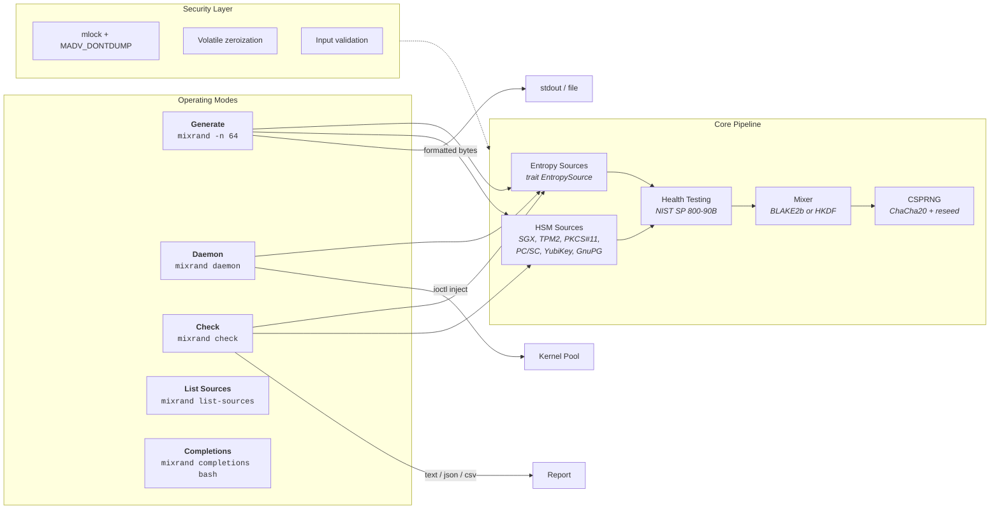

### Entropy Source Cascade

Mixrand tries entropy sources in priority order. The first source that succeeds and passes continuous health testing provides the output. Each source implements the `EntropySource` trait, enabling runtime discovery, filtering, and statistical testing.

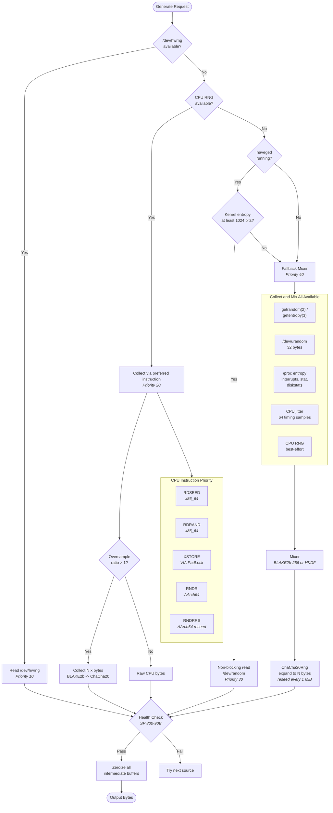

### Cryptographic Mixing

All entropy from the fallback path passes through a two-stage construction: compression via a cryptographic hash, then expansion via ChaCha20. Two mixer modes are available.

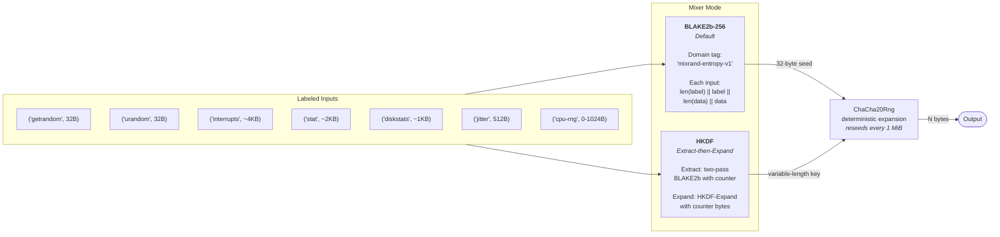

### Continuous Health Testing

Every entropy sample passes through NIST SP 800-90B continuous health tests before being accepted. This catches stuck or degraded hardware RNG sources at runtime.

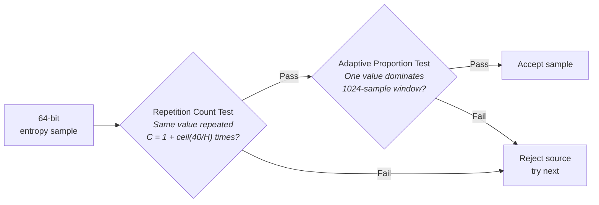

With the default min-entropy estimate H=4.0 bits per sample, the RCT cutoff is 11 consecutive identical values and the APT uses a window of 1024 samples with a binomial-distribution-based threshold.

### Daemon Mode

The daemon monitors the Linux kernel entropy pool and injects freshly mixed entropy with adaptive rate control.

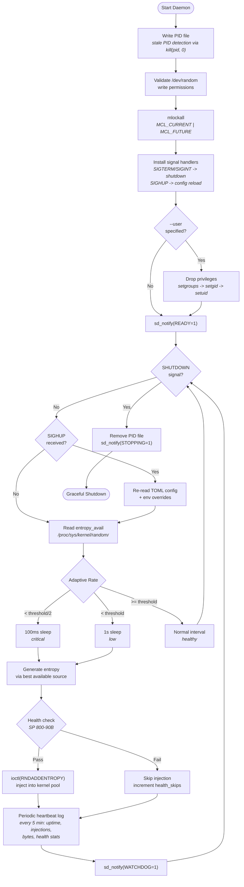

### Statistical Validation (`mixrand check`)

Probes all available entropy sources and runs continuous statistical tests against each one. Results are available as text, JSON, or CSV for CI/CD integration.

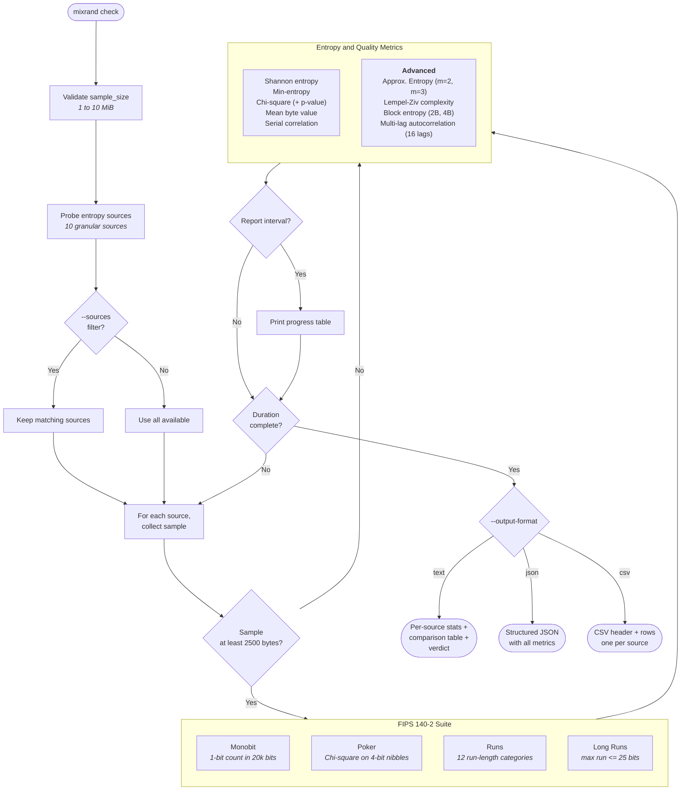

### Configuration Layering

Four configuration layers merge in order — later layers override earlier ones.

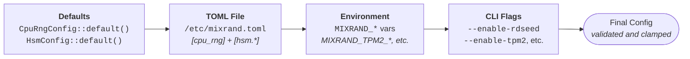

CLI fields use `Option<T>` so "not set" is distinguishable from "set to default value". Only explicitly-set fields override earlier layers. Out-of-range values are clamped with a logged warning.

### Security Model

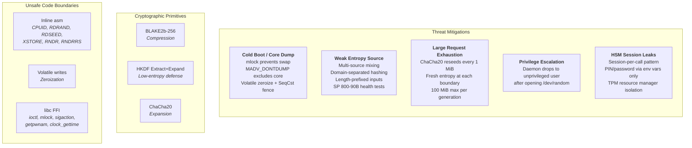

### HSM & Secure Element Integration

Mixrand supports hardware security modules and secure elements as high-priority entropy sources. When compiled with the appropriate feature flags, HSM sources are tried before CPU and system sources in the priority cascade.

#### Full Source Priority Cascade

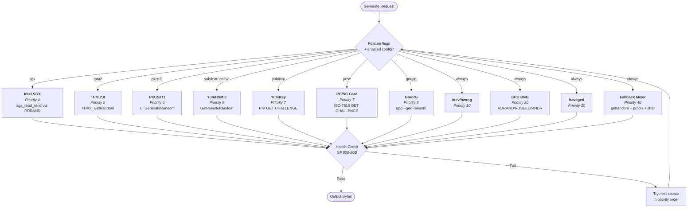

#### PKCS#11 Session Flow

PKCS#11 provides a standard interface to any compliant HSM. Mixrand opens a session per `collect()` call to ensure thread safety.

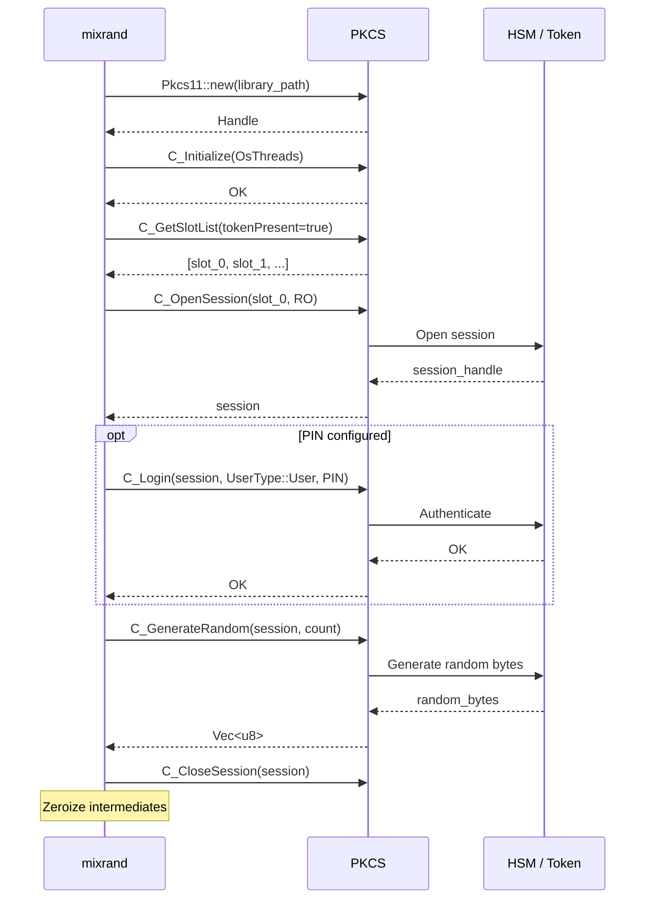

#### Smart Card (PC/SC) APDU Flow

PC/SC sources (including YubiKey) use ISO 7816-4 GET CHALLENGE APDUs to request random bytes from the card.

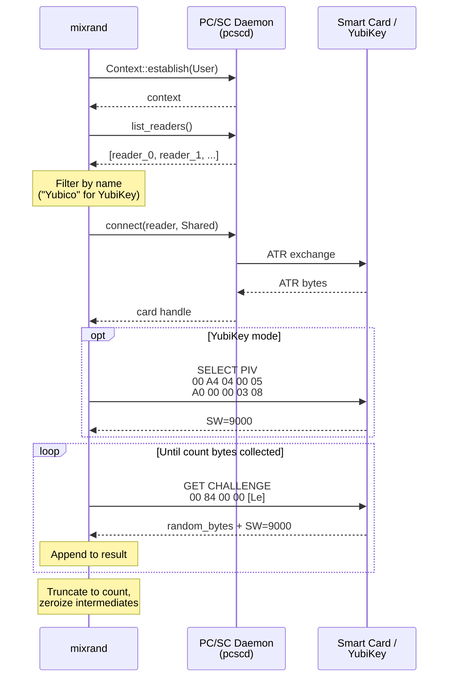

#### TPM 2.0 Entropy Flow

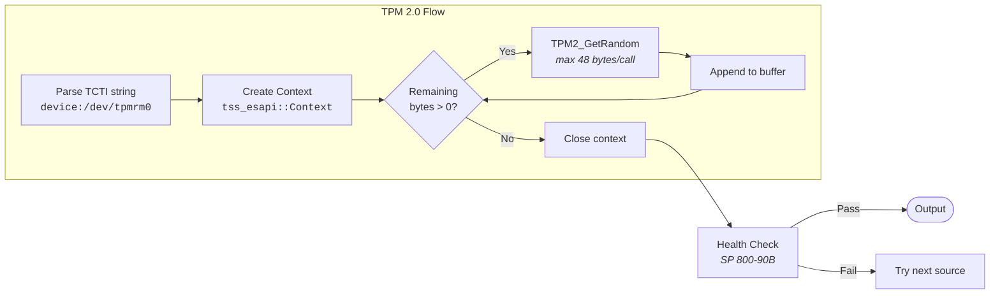

#### Per-Source Details

| Source | Feature Flag | System Library | Prerequisites |
|--------|-------------|----------------|---------------|
| **SGX** | `sgx` | `libsgx_urts` (runtime) | Intel SGX CPU + driver (`/dev/sgx_enclave`) |
| **TPM2** | `tpm2` | `libtss2-dev` (compile) | TPM 2.0 chip + `/dev/tpmrm0` |
| **PKCS#11** | `pkcs11` | None (runtime dlopen) | Vendor PKCS#11 `.so` library |
| **YubiHSM** | `yubihsm-native` | None (pure Rust) | YubiHSM 2 + `yubihsm-connector` |
| **YubiKey** | `yubikey` | `libpcsclite-dev` (compile) | YubiKey + USB reader + `pcscd` |
| **PC/SC** | `pcsc` | `libpcsclite-dev` (compile) | Smart card + reader + `pcscd` |
| **GnuPG** | `gnupg` | None | `gpg` binary on `$PATH` |

**PKCS#11 compatible devices** (use the `pkcs11` source with the appropriate library path):

| Device | Library Path |
|--------|-------------|
| SoftHSM 2 | `/usr/lib/softhsm/libsofthsm2.so` |
| YubiHSM 2 | `/usr/lib/libyubihsm_pkcs11.so` |
| Thales Luna | `/usr/lib/libCryptoki2_64.so` |
| AWS CloudHSM | `/opt/cloudhsm/lib/libcloudhsm_pkcs11.so` |
| Nitrokey HSM | `/usr/lib/opensc-pkcs11.so` |

## Use Cases

### Generate Cryptographic Keys

```bash
# AES-256 key (32 bytes)
mixrand -n 32 -f hex

# Ed25519 seed (32 bytes, raw binary for import)
mixrand -n 32 -f raw -o ed25519_seed.bin

# TLS pre-master secret (48 bytes, base64 for config files)
mixrand -n 48 -f base64

# 10 independent API tokens
mixrand --count 10 -n 32 -f base64url
```

### Generate Passwords and Tokens

```bash
# 20-character printable password (94-char alphabet: ! through ~)
mixrand -n 20 -f text

# 128-bit hex token for URL parameters
mixrand -n 16 -f hex

# UUID-length random identifier
mixrand -n 16 -f hex
```

### Validate Entropy Source Quality

```bash
# Quick 30-second smoke test of all sources
mixrand check -d 30s

# Deep 10-minute test of CPU instructions only
mixrand check -d 10m --sources=rdseed,rdrand

# CI/CD pipeline: JSON output for automated quality gates
mixrand check -d 1m --output-format json -q

# Spreadsheet-friendly CSV with progress every 5 seconds
mixrand check -d 5m -r 5 --output-format csv

# Check what's available before running tests
mixrand list-sources
```

### Feed the Linux Kernel Entropy Pool

```bash
# Basic daemon with defaults (threshold=256 bits, poll every 5s, 64-byte batches)
sudo mixrand daemon

# Aggressive settings for high-throughput servers
sudo mixrand daemon -t 512 -i 2 -b 256

# Production deployment with privilege dropping and systemd integration
sudo mixrand daemon \
  --threshold 384 \
  --interval 5 \
  --batch-size 128 \
  --user nobody \
  --pid-file /var/run/mixrand.pid \
  --syslog \
  --log-level info
```

### Prefer Specific Hardware

```bash
# Force RDRAND only (disable RDSEED, useful for benchmarking)
mixrand -n 64 --enable-rdseed false --cpu-rng-prefer rdrand

# Use HKDF mixer for low-entropy environments
mixrand -n 64 --mixer-mode hkdf

# Oversample 4x for defense-in-depth (collect 4x raw bytes, compress through BLAKE2b)
mixrand -n 64 --oversample 4

# Show the effective merged configuration
mixrand --show-config
```

### Scripting and Automation

```bash
# Generate a key and use it immediately
KEY=$(mixrand -n 32 -f hex)
echo "Generated key: $KEY"

# Seed a PRNG in another tool
mixrand -n 32 -f raw | openssl enc -aes-256-cbc -pass stdin -in plain.txt -out cipher.bin

# Generate shell completions
mixrand completions bash > /etc/bash_completion.d/mixrand
mixrand completions zsh > ~/.zfunc/_mixrand
mixrand completions fish > ~/.config/fish/completions/mixrand.fish
```

### HSM-Backed Key Generation

```bash
# TPM2 entropy for defense-in-depth key generation
mixrand -n 32 -f hex --enable-tpm2

# PKCS#11 HSM entropy (e.g., with SoftHSM for testing)
MIXRAND_PKCS11_PIN=1234 mixrand -n 64 -f base64 \
  --pkcs11-library /usr/lib/softhsm/libsofthsm2.so

# YubiHSM 2 via native connector
MIXRAND_YUBIHSM_PASSWORD=password mixrand -n 32 -f hex --enable-yubihsm

# YubiKey PIV entropy (requires YubiKey inserted)
mixrand -n 32 -f hex --enable-yubikey

# GnuPG entropy (no hardware needed, just gpg on PATH)
mixrand -n 32 -f hex --enable-gnupg
```

### Smart Card Entropy for Air-Gapped Systems

```bash
# Use any ISO 7816 smart card (JavaCard, OpenPGP card)
mixrand -n 256 -f raw -o seed.bin --enable-pcsc

# Validate smart card entropy quality
mixrand check -d 5m --sources=pcsc,yubikey

# Compare smart card entropy against CPU and system sources
mixrand check -d 1m --output-format json
```

### Multi-Source Entropy Ceremony

For high-assurance key generation, combine multiple independent entropy sources:

```bash
# Build with all HSM sources
cargo build --release --features all-sources

# Verify which sources are available on this machine
mixrand list-sources

# Generate a key — mixrand automatically uses the highest-priority
# available source, with health check fallback through the cascade
mixrand -n 32 -f hex -v  # verbose shows which source was used

# Run deep statistical tests on all sources (5 minutes)
mixrand check -d 5m --output-format json -o entropy_report.json
```

### Production HSM Deployment

```bash
# Configure via TOML for production servers
cat > /etc/mixrand.toml << 'EOF'
[cpu_rng]
prefer = "rdseed"
oversample = 4

[hsm.tpm2]
enabled = true

[hsm.pkcs11]
enabled = true
library_path = "/opt/cloudhsm/lib/libcloudhsm_pkcs11.so"
slot_id = 0
EOF

# Set HSM credentials via environment (never in config files)
export MIXRAND_PKCS11_PIN="hsm-session-pin"

# Run daemon with HSM-supplemented entropy feeding the kernel pool
sudo mixrand daemon --threshold 384 --batch-size 128 --syslog
```

## Installation

```bash
# Core build (no HSM dependencies)
cargo build --release
sudo cp target/release/mixrand /usr/local/bin/

# With GnuPG support (no system library deps)
cargo build --release --features gnupg

# With all standard HSM sources
# Prerequisites: apt install libtss2-dev libpcsclite-dev  (Debian/Ubuntu)
#                dnf install tpm2-tss-devel pcsc-lite-devel (Fedora)
cargo build --release --features hsm

# With everything (including YubiHSM native + SGX)
cargo build --release --features all-sources
```

### Feature Flags

| Feature | Description | System Library |
|---------|-------------|----------------|
| `pkcs11` | PKCS#11 generic HSM interface | None (runtime dlopen) |
| `tpm2` | TPM 2.0 entropy via ESAPI | `libtss2-dev` |
| `pcsc` | PC/SC smart card support | `libpcsclite-dev` |
| `yubikey` | YubiKey PIV applet (implies `pcsc`) | `libpcsclite-dev` |
| `gnupg` | GnuPG subprocess | None |
| `yubihsm-native` | YubiHSM 2 direct HTTP/USB | None (pure Rust) |
| `sgx` | Intel SGX enclave entropy | None (runtime `libsgx_urts`) |
| `hsm` | Meta: pkcs11 + tpm2 + pcsc + yubikey + gnupg | All of the above |
| `all-sources` | Meta: hsm + yubihsm-native + sgx | All of the above |

## Usage Reference

### Generate random bytes

```bash
mixrand [OPTIONS]

Options:
  -n, --bytes <N>            Number of random bytes (default: 32, max: 100 MiB)
  -f, --format <FORMAT>      Output format [hex|hex-upper|raw|base64|base64url|
                             uuencode|text|octal|binary] (default: hex)
  -o, --output-file <PATH>   Write to file instead of stdout
      --count <N>            Generate N independent outputs (max: 10,000)
      --show-config          Print effective merged configuration and exit
      --config <PATH>        Configuration file (default: /etc/mixrand.toml)
  -v, --verbose              Set log level to debug
  -q, --quiet                Set log level to error only
```

### Daemon mode

```bash
mixrand daemon [OPTIONS]

Options:
  -t, --threshold <BITS>     Inject when pool drops below this (default: 256)
  -i, --interval <SECS>      Normal poll interval in seconds (default: 5)
  -b, --batch-size <BYTES>   Bytes per injection (default: 64)
  -c, --credit-ratio <N>     Entropy bits credited per byte, 1-8 (default: 4)
      --user <USERNAME>      Drop privileges to this user after opening /dev/random
      --pid-file <PATH>      Write PID file for process management
      --syslog               Send log messages to syslog
```

### Statistical validation

```bash
mixrand check [OPTIONS]

Options:
  -d, --duration <DURATION>  Test duration: 30s, 5m, 1h, 2d (default: 1m)
  -s, --sample-size <BYTES>  Bytes per sample, FIPS requires >= 2500 (default: 2500, max: 10 MiB)
  -r, --report-interval <S>  Progress update interval in seconds (default: 10)
      --sources <LIST>       Comma-separated source names to test (default: all available)
  -q, --quiet                Suppress progress output
      --output-format <FMT>  Output format [text|json|csv] (default: text)
```

### Other commands

```bash
mixrand list-sources             # Show available entropy sources and their status
mixrand completions <SHELL>      # Generate shell completions (bash, zsh, fish, powershell)
```

### Logging options (available on all commands)

```bash
      --log-level <LEVEL>    Log level [error|warn|info|debug]
      --log-file <PATH>      Append log messages to file
      --log-format <FMT>     Log format [text|json] (default: text)
      --syslog               Send log messages to syslog
```

### CPU RNG options (available on all commands)

```bash
      --enable-rdseed [BOOL]      Enable/disable RDSEED instruction
      --enable-rdrand [BOOL]      Enable/disable RDRAND instruction
      --enable-xstore [BOOL]      Enable/disable XSTORE instruction
      --enable-rndr [BOOL]        Enable/disable AArch64 RNDR instruction
      --enable-rndrrs [BOOL]      Enable/disable AArch64 RNDRRS instruction
      --rdrand-retries <N>        RDRAND retry count, 1-100 (default: 10)
      --rdseed-retries <N>        RDSEED retry count, 1-100 (default: 10)
      --rndr-retries <N>          RNDR retry count, 1-100 (default: 10)
      --rndrrs-retries <N>        RNDRRS retry count, 1-100 (default: 10)
      --xstore-quality <N>        XSTORE quality factor, 0-3 (default: 3)
      --cpu-rng-prefer <INSTR>    Preferred instruction [rdseed|rdrand|xstore|rndr|rndrrs]
      --fallback-mix-bytes <N>    CPU entropy bytes for fallback, 8-1024 (default: 32)
      --oversample <N>            Standalone CPU RNG oversample ratio, 1-16 (default: 2)
      --mixer-mode <MODE>         Mixer [blake2b|hkdf] (default: blake2b)
```

### HSM options (available on all commands, requires feature flags)

```bash
      --enable-tpm2 [BOOL]        Enable/disable TPM 2.0 source
      --enable-pkcs11 [BOOL]      Enable/disable PKCS#11 source
      --enable-pcsc [BOOL]        Enable/disable PC/SC smart card source
      --enable-yubikey [BOOL]     Enable/disable YubiKey source
      --enable-gnupg [BOOL]       Enable/disable GnuPG source
      --enable-yubihsm [BOOL]     Enable/disable YubiHSM native source
      --enable-sgx [BOOL]         Enable/disable Intel SGX source
      --pkcs11-library <PATH>     Path to PKCS#11 .so library
      --tpm2-device <PATH>        TPM2 device path (default: /dev/tpmrm0)
```

## Configuration

### TOML file

Default path: `/etc/mixrand.toml` (override with `--config`).

```toml
[cpu_rng]
enable_rdseed = true
enable_rdrand = true
enable_xstore = true
enable_rndr = true
enable_rndrrs = true
rdrand_retries = 10         # 1-100
rdseed_retries = 10         # 1-100
rndr_retries = 10           # 1-100
rndrrs_retries = 10         # 1-100
xstore_quality = 3          # 0-3
prefer = "rdseed"           # rdseed | rdrand | xstore | rndr | rndrrs
fallback_mix_bytes = 32     # CPU entropy bytes mixed into fallback (8-1024)
oversample = 2              # standalone CPU RNG oversample ratio (1-16)
mixer_mode = "blake2b"      # blake2b | hkdf

[hsm.tpm2]
enabled = true
tcti = "device:/dev/tpmrm0"   # TCTI connection string

[hsm.pkcs11]
enabled = true
library_path = "/usr/lib/softhsm/libsofthsm2.so"
slot_id = 0
# pin — set via MIXRAND_PKCS11_PIN env var (never in config files)

[hsm.pcsc]
enabled = true
# reader = "Yubico"           # optional reader name filter (substring)
max_le = 32                    # max bytes per GET CHALLENGE APDU (1-255)

[hsm.yubikey]
enabled = true
# serial = 12345678            # optional: specific YubiKey serial number

[hsm.gnupg]
enabled = true
# gpg_path = "/usr/bin/gpg2"   # override gpg binary path
quality_level = 2              # 0=low, 1=medium, 2=high (default)

[hsm.yubihsm]
enabled = true
connector_url = "http://127.0.0.1:12345"
auth_key_id = 1
# password — set via MIXRAND_YUBIHSM_PASSWORD env var

[hsm.sgx]
enabled = true
# enclave_path = "/usr/lib/mixrand_entropy_enclave.signed.so"
```

### Environment variables

All settings can be overridden via `MIXRAND_*` environment variables (layer between TOML and CLI):

| Variable | Type | Example |
|---|---|---|
| `MIXRAND_ENABLE_RDSEED` | bool | `true`, `false`, `1`, `0`, `yes`, `no` |
| `MIXRAND_ENABLE_RDRAND` | bool | `true` |
| `MIXRAND_ENABLE_XSTORE` | bool | `false` |
| `MIXRAND_ENABLE_RNDR` | bool | `true` |
| `MIXRAND_ENABLE_RNDRRS` | bool | `true` |
| `MIXRAND_RDRAND_RETRIES` | u32 | `20` |
| `MIXRAND_RDSEED_RETRIES` | u32 | `10` |
| `MIXRAND_RNDR_RETRIES` | u32 | `10` |
| `MIXRAND_RNDRRS_RETRIES` | u32 | `10` |
| `MIXRAND_XSTORE_QUALITY` | u32 | `3` |
| `MIXRAND_PREFER` | string | `rdseed`, `rdrand`, `xstore`, `rndr`, `rndrrs` |
| `MIXRAND_FALLBACK_MIX_BYTES` | usize | `64` |
| `MIXRAND_OVERSAMPLE` | u32 | `4` |
| `MIXRAND_MIXER_MODE` | string | `blake2b`, `hkdf` |

#### HSM environment variables

| Variable | Type | Example |
|---|---|---|
| `MIXRAND_TPM2_ENABLED` | bool | `true` |
| `MIXRAND_TPM2_TCTI` | string | `device:/dev/tpmrm0` |
| `MIXRAND_PKCS11_ENABLED` | bool | `true` |
| `MIXRAND_PKCS11_LIBRARY_PATH` | string | `/usr/lib/softhsm/libsofthsm2.so` |
| `MIXRAND_PKCS11_SLOT_ID` | u64 | `0` |
| `MIXRAND_PKCS11_PIN` | string | *(sensitive — env var only)* |
| `MIXRAND_PCSC_ENABLED` | bool | `true` |
| `MIXRAND_PCSC_READER` | string | `Yubico` |
| `MIXRAND_PCSC_MAX_LE` | u8 | `32` |
| `MIXRAND_YUBIKEY_ENABLED` | bool | `true` |
| `MIXRAND_YUBIKEY_SERIAL` | u32 | `12345678` |
| `MIXRAND_GNUPG_ENABLED` | bool | `true` |
| `MIXRAND_GNUPG_GPG_PATH` | string | `/usr/bin/gpg2` |
| `MIXRAND_GNUPG_QUALITY_LEVEL` | u8 | `2` |
| `MIXRAND_YUBIHSM_ENABLED` | bool | `true` |
| `MIXRAND_YUBIHSM_CONNECTOR_URL` | string | `http://127.0.0.1:12345` |
| `MIXRAND_YUBIHSM_AUTH_KEY_ID` | u16 | `1` |
| `MIXRAND_YUBIHSM_PASSWORD` | string | *(sensitive — env var only)* |
| `MIXRAND_SGX_ENABLED` | bool | `true` |
| `MIXRAND_SGX_ENCLAVE_PATH` | string | `/usr/lib/mixrand_entropy_enclave.signed.so` |

## API and Implementation Reference

### EntropySource Trait

All entropy sources implement a common trait for pluggable, priority-ordered fallback:

```rust
pub trait EntropySource: Send + Sync {
    fn name(&self) -> &str;                                // Machine-friendly name
    fn description(&self) -> &str;                         // Human-readable description
    fn priority(&self) -> u32;                             // Lower = tried first
    fn is_available(&self) -> bool;                        // Quick availability check
    fn source_type(&self) -> &str { "software" }           // "hardware", "system", or "software"
    fn collect(&self, count: usize) -> Result<Vec<u8>, Error>;  // Collect count bytes
}
```

### Entropy Sources

| Source | Priority | Type | Platform | Feature | Description |
|--------|----------|------|----------|---------|-------------|
| `sgx` | 4 | hardware | Linux x86_64 | `sgx` | Intel SGX enclave entropy (RDRAND with SGX verification) |
| `tpm2` | 5 | hardware | Linux | `tpm2` | TPM 2.0 `TPM2_GetRandom` via ESAPI |
| `pkcs11` | 6 | hardware | all | `pkcs11` | PKCS#11 `C_GenerateRandom` (any compliant token) |
| `yubihsm` | 6 | hardware | all | `yubihsm-native` | YubiHSM 2 `GetPseudoRandom` via HTTP connector |
| `yubikey` | 7 | hardware | all | `yubikey` | YubiKey PIV applet GET CHALLENGE |
| `pcsc` | 7 | hardware | all | `pcsc` | PC/SC smart card ISO 7816 GET CHALLENGE |
| `gnupg` | 8 | software | all | `gnupg` | GnuPG `gpg --gen-random` subprocess |
| `hwrng` | 10 | hardware | Linux | — | `/dev/hwrng` device |
| `cpurng` | 20 | hardware | all | — | Best available CPU instruction (with oversampling) |
| `rdseed` | 21 | hardware | x86_64 | — | Intel/AMD RDSEED instruction |
| `rdrand` | 22 | hardware | x86_64 | — | Intel/AMD RDRAND instruction |
| `xstore` | 23 | hardware | x86_64 | — | VIA PadLock XSTORE instruction |
| `rndr` | 24 | hardware | AArch64 | — | ARM FEAT_RNG RNDR instruction |
| `rndrrs` | 25 | hardware | AArch64 | — | ARM FEAT_RNG RNDRRS (reseeded) |
| `haveged` | 30 | system | Linux | — | `/dev/random` when haveged process is running |
| `getrandom` | 35 | system | Linux/macOS | — | `getrandom(2)` / `getentropy(3)` syscall |
| `urandom` | 36 | system | Unix | — | `/dev/urandom` device |
| `fallback` | 40 | software | all | — | Multi-source mix (getrandom + procfs + jitter + CPU) |

The main `generate()` function uses core sources (hwrng, cpurng, haveged, fallback) plus any enabled HSM sources. Sources are sorted by priority and tried in order. The `check` command probes all granular sources including HSM devices for per-source statistical testing.

### Mixer Modes

**BLAKE2b-256 (default)**: Single-pass compression with domain separation tag `mixrand-entropy-v1`. Each input is length-prefixed: `len(label) || label || len(data) || data`. Produces a fixed 32-byte seed.

**HKDF (extract-then-expand)**: Two-stage construction for defense-in-depth with potentially low-entropy inputs.
- Extract: Two-pass BLAKE2b — first pass hashes all domain-tagged inputs, second pass re-hashes with a counter byte to produce a 32-byte pseudo-random key (PRK).
- Expand: HKDF-Expand using BLAKE2b with the PRK and a u8 counter, producing arbitrary-length output in 32-byte blocks.

### CSPRNG

ChaCha20Rng from the `rand_chacha` crate, seeded from the 32-byte mixer output.

- **Single-pass** (`generate`): For requests <= 1 MiB. Seeds once, generates all bytes, zeroizes RNG state.
- **Reseeding** (`generate_reseeding`): For requests > 1 MiB. Zeroizes and re-seeds from fresh entropy at each 1 MiB boundary to limit CSPRNG state lifetime.

All seed material is `mlock`'d into physical memory and excluded from core dumps during use. RNG internal state is volatile-zeroized and then `mem::forget`'d to prevent Drop from touching cleared memory.

### Health Testing (NIST SP 800-90B)

Two continuous tests run on every entropy sample:

| Test | Purpose | Parameters (H=4.0) |
|------|---------|---------------------|
| Repetition Count (RCT) | Detect stuck source | Cutoff C = 1 + ceil(40/H) = 11 |
| Adaptive Proportion (APT) | Detect biased source | Window W = 1024, threshold from binomial distribution |

The default min-entropy estimate H=4.0 bits per 64-bit sample is a deliberate underestimate for defense-in-depth. True hardware RNG entropy should be significantly higher. Sources that fail health testing are skipped and the next source in priority order is tried.

### Statistical Tests

The `mixrand check` command runs these tests against each available entropy source:

**FIPS 140-2 Suite** (requires >= 2500-byte samples):
- **Monobit**: Count of 1-bits in 20,000 bits; passes if 9,725 < count < 10,275
- **Poker**: Chi-square test on 5,000 4-bit nibbles; passes if 2.16 < X^2 < 46.17
- **Runs**: Run-length distribution across 12 categories (runs of 1-6+ for both 0s and 1s)
- **Long Runs**: Maximum consecutive same-bit run; passes if <= 25 bits

**Entropy Metrics**:
- Shannon entropy (bits/byte, max 8.0)
- Min-entropy (-log2 of max frequency)
- Chi-square statistic with p-value (df=255)
- Mean byte value (expected 127.5)
- Serial correlation (lag-1 autocorrelation)
- Approximate entropy ApEn(m=2) and ApEn(m=3) (expected ~ ln(2) for random data)
- Lempel-Ziv complexity ratio (expected ~ 1.0 for random data)
- Block entropy over 2-byte and 4-byte blocks (bits/byte)
- Multi-lag autocorrelation (16 lags)

### Error Types

```rust
pub enum Error {
    Io(io::Error),            // File, device, or network I/O failure
    NoEntropy(String),        // All entropy sources failed or unavailable
    InvalidArgs(String),      // Invalid configuration or CLI arguments
}
```

## Platform Support

| Platform | CPU RNG | Syscall | Daemon | Entropy Sources |
|---|---|---|---|---|
| Linux x86_64 | RDSEED, RDRAND, XSTORE | `getrandom(2)` | Full support | All |
| Linux AArch64 | RNDR, RNDRRS | `getrandom(2)` | Full support | All |
| macOS x86_64 | RDSEED, RDRAND | `getentropy(3)` | N/A (no `/proc`) | hwrng, cpurng, getrandom, fallback |
| macOS AArch64 | RNDR, RNDRRS | `getentropy(3)` | N/A (no `/proc`) | hwrng, cpurng, getrandom, fallback |

CPU instruction availability is detected at runtime via CPUID (x86_64) or `getauxval`/`sysctlbyname` (AArch64) and cached in atomic variables. On macOS, `MADV_DONTDUMP` is not available; `mlock` still provides swap protection.

## Security

- **Zeroization**: All intermediate entropy buffers, CSPRNG state, mixer output, and hash digests are volatile-zeroized with `SeqCst` fence. RNG state is explicitly `mem::forget`'d after zeroization to prevent drop-based recovery.
- **Memory protection**: Sensitive buffers are locked into physical memory (`mlock`) and excluded from core dumps (`MADV_DONTDUMP` on Linux). Failures are non-fatal (user may lack `CAP_IPC_LOCK`).
- **Cryptographic mixing**: BLAKE2b-256 with domain separation tag and length-prefixed inputs prevents canonicalization attacks. HKDF mode provides two-stage extraction for defense-in-depth.
- **CSPRNG reseeding**: ChaCha20 reseeds from fresh entropy every 1 MiB, preventing long-lived key exposure.
- **Continuous health testing**: NIST SP 800-90B Repetition Count and Adaptive Proportion tests run on every entropy sample, detecting stuck or biased sources at runtime.
- **Privilege dropping**: Daemon mode supports dropping to an unprivileged user after opening `/dev/random`, minimizing attack surface.
- **Input validation**: Byte count capped at 100 MiB, iteration count at 10,000, and sample size at 10 MiB to prevent resource exhaustion.
- **Atomic ordering**: Signal handler flags use `Release`/`Acquire` ordering for correct visibility on weak memory architectures (ARM, RISC-V).
- **Unsafe code boundaries**: Limited to inline x86_64/AArch64 asm (CPUID, RDRAND, RDSEED, XSTORE, RNDR, RNDRRS), volatile writes for zeroization, and libc FFI (ioctl, mlock, sigaction, getpwnam, clock_gettime).
- **HSM session isolation**: PKCS#11, TPM2, and PC/SC sessions are opened and closed per `collect()` call, preventing stale handle reuse and ensuring `Send + Sync` safety.
- **Credential protection**: HSM PINs and passwords (`MIXRAND_PKCS11_PIN`, `MIXRAND_YUBIHSM_PASSWORD`) are read exclusively from environment variables, never stored in TOML config files or passed via CLI arguments (which would be visible in process listings).
- **TPM resource manager**: Connections go through the kernel resource manager (`/dev/tpmrm0`), which serializes access and prevents interference with other TPM clients.

## Additional Resources

### Standards and Specifications

| Standard | Relevance |
|----------|-----------|
| [NIST SP 800-90B](https://csrc.nist.gov/publications/detail/sp/800-90b/final) | Entropy source health testing (RCT, APT) |
| [FIPS 140-2](https://csrc.nist.gov/publications/detail/fips/140/2/final) | Statistical test suite (monobit, poker, runs) |
| [PKCS#11 v3.1 (OASIS)](https://docs.oasis-open.org/pkcs11/pkcs11-spec/v3.1/pkcs11-spec-v3.1.html) | HSM cryptographic token interface |
| [TCG TPM 2.0 Specification](https://trustedcomputinggroup.org/resource/tpm-library-specification/) | TPM2_GetRandom command |
| [ISO/IEC 7816-4](https://www.iso.org/standard/77180.html) | Smart card APDU commands (GET CHALLENGE) |
| [PC/SC Specification](https://pcscworkgroup.com/specifications/) | Smart card reader interface |
| [Intel SGX Developer Reference](https://www.intel.com/content/www/us/en/developer/tools/software-guard-extensions/overview.html) | SGX enclave development |
| [RFC 8439](https://datatracker.ietf.org/doc/html/rfc8439) | ChaCha20-Poly1305 (ChaCha20 CSPRNG basis) |
| [BLAKE2 Specification](https://www.blake2.net/) | BLAKE2b-256 entropy mixer |

### Hardware Documentation

| Device | Documentation |
|--------|--------------|
| YubiKey | [PIV Application Documentation](https://developers.yubico.com/PIV/) |
| YubiHSM 2 | [YubiHSM 2 SDK Documentation](https://developers.yubico.com/YubiHSM2/) |
| SoftHSM 2 | [OpenDNSSEC SoftHSM](https://www.opendnssec.org/softhsm/) (testing/development) |

## License

See repository for license information.
