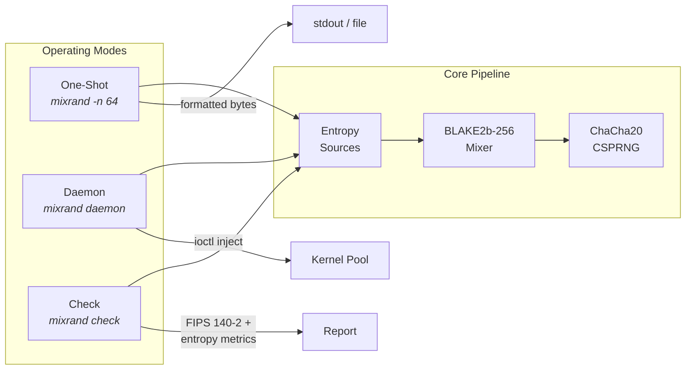
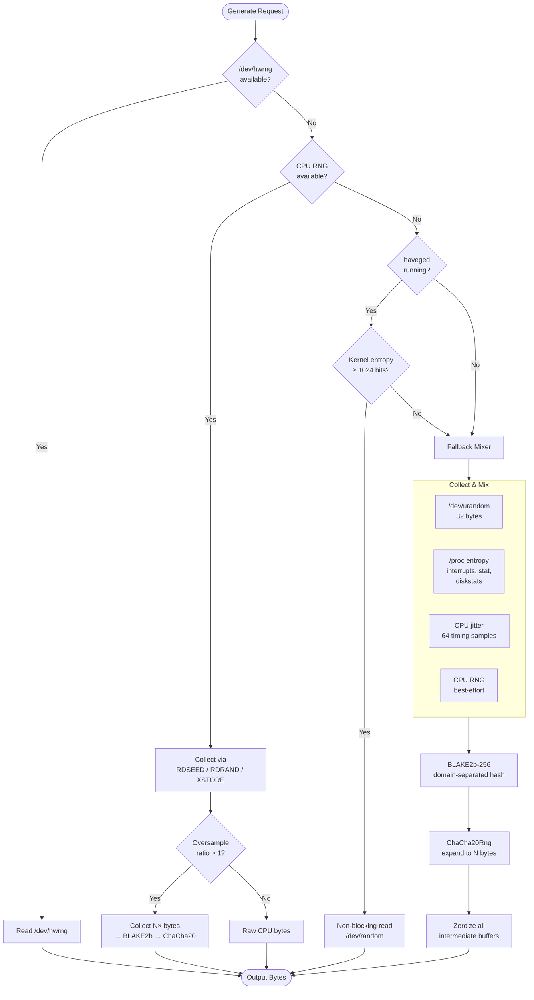
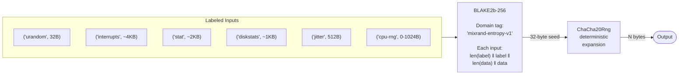
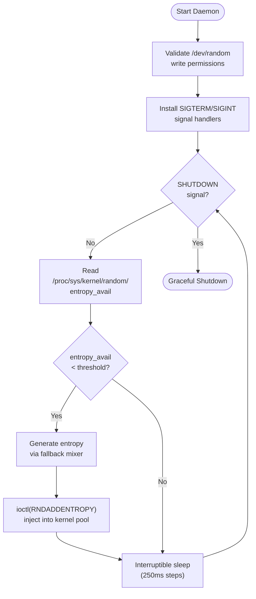
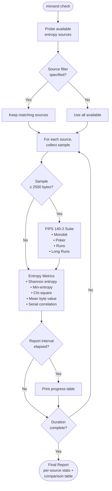

# mixrand

Secure random byte generator that mixes multiple entropy sources cryptographically before output.

## Features

- **Multi-source entropy**: Tries hardware RNG, CPU instructions (RDSEED/RDRAND/XSTORE), haveged, and a fallback mixer — in priority order
- **Cryptographic mixing**: All entropy is mixed through BLAKE2b-256 with domain separation, then expanded via ChaCha20
- **9 output formats**: hex, hex-upper, raw, base64, base64url, uuencode, text, octal, binary
- **Daemon mode**: Monitors the Linux kernel entropy pool and injects mixed entropy when it runs low
- **Statistical validation**: Built-in FIPS 140-2 test suite and entropy metrics via `mixrand check`
- **Structured logging**: Configurable log level with stderr, file, and syslog backends
- **Security hardened**: Intermediate buffers are volatile-zeroized; unsafe code is limited to inline x86_64 asm, volatile writes, and libc FFI

## High-Level Overview



## Entropy Pipeline

Mixrand tries entropy sources in priority order, falling through to the next if one is unavailable. The first source that succeeds provides the output.



## Cryptographic Mixing

All entropy — whether from the fallback path or the CPU RNG oversample path — passes through a two-stage construction: compression via BLAKE2b-256, then expansion via ChaCha20.



## Daemon Mode

The daemon monitors the Linux kernel entropy pool and injects freshly mixed entropy when it drops below a configurable threshold.



## Statistical Validation (`mixrand check`)

The `check` subcommand probes all available entropy sources and runs continuous statistical tests against each one, then produces a comparative report.



## Configuration Layering

Three configuration layers merge in order — later layers override earlier ones.


CLI fields use `Option<T>` so "not set" is distinguishable from "set to default value". Only explicitly-set fields override earlier layers.

## Installation

```bash
cargo build --release
sudo cp target/release/mixrand /usr/local/bin/
```

## Usage

### Generate random bytes

```bash
# 32 bytes as hex (default)
mixrand

# 64 bytes as raw binary
mixrand -n 64 -f raw

# 16 bytes as base64
mixrand -n 16 -f base64

# Write to file
mixrand -n 256 -o /tmp/random.bin
```

### Daemon mode

Monitors `/proc/sys/kernel/random/entropy_avail` and injects mixed entropy when the pool drops below threshold. Requires root.

```bash
sudo mixrand daemon
sudo mixrand daemon -t 512 -i 10 -b 128
```

### Statistical validation

Run FIPS 140-2 tests and entropy metrics against each available source.

```bash
mixrand check                            # 1 minute, all sources
mixrand check -d 5m                      # 5 minutes
mixrand check --sources=rdseed,rdrand    # specific sources only
mixrand check -d 30s -r 5               # 30s, report every 5s
```

### Logging

```bash
# Default: warn level for one-shot, info level for daemon
mixrand -n 32                                # no info output
mixrand -n 32 --log-level info               # shows entropy source
mixrand -n 32 --log-level debug              # shows fallback cascade details

# Log to file
mixrand -n 32 --log-file /tmp/mixrand.log

# Send to syslog (daemon mode)
sudo mixrand daemon --syslog --log-level debug
```

## Configuration

### TOML file

Default path: `/etc/mixrand.toml` (override with `--config`).

```toml
[cpu_rng]
enable_rdseed = true
enable_rdrand = true
enable_xstore = true
rdrand_retries = 10
rdseed_retries = 10
xstore_quality = 3
prefer = "rdseed"        # rdseed | rdrand | xstore
fallback_mix_bytes = 32  # CPU entropy bytes mixed into fallback (0-1024)
oversample = 2           # standalone CPU RNG oversample ratio (1-16)
```

## Security

- All intermediate entropy buffers are volatile-zeroized with `SeqCst` fence
- Unsafe code is limited to: inline x86_64 asm (CPUID/RDRAND/RDSEED/XSTORE), volatile writes for zeroization, libc FFI (ioctl, clock_gettime, sigaction)
- Entropy mixing uses BLAKE2b-256 with domain separation and length-prefixed inputs to prevent canonicalization attacks
- Output expansion uses ChaCha20, a well-studied stream cipher

## License

See repository for license information.
