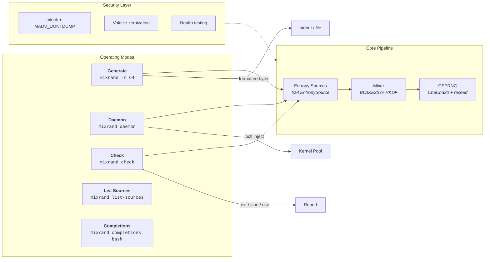
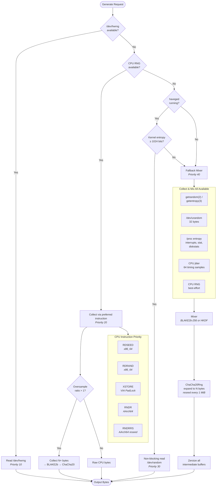
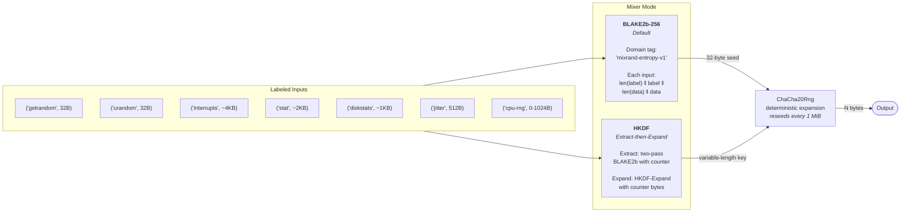
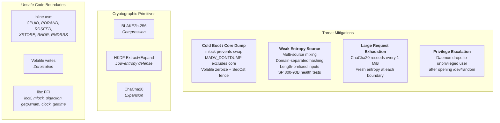
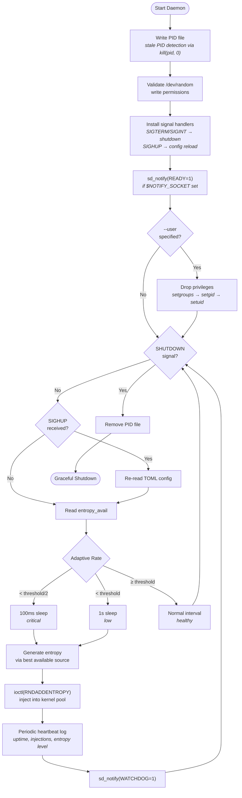
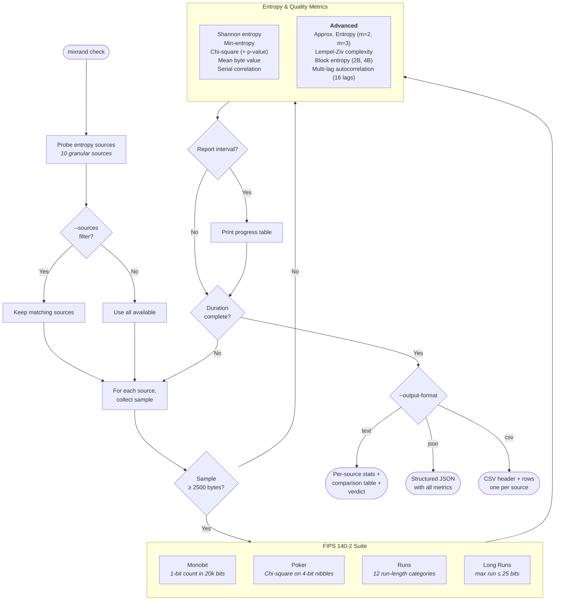

# mixrand

Secure random byte generator that mixes multiple entropy sources cryptographically before output. Cross-platform (x86_64 + AArch64), security-hardened, with a Linux kernel entropy daemon and comprehensive statistical validation.

## Features

- **Multi-source entropy**: Priority-ordered cascade across hardware RNG, CPU instructions (RDSEED, RDRAND, XSTORE, RNDR, RNDRRS), haveged, getrandom syscall, and a fallback mixer
- **Cross-platform CPU RNG**: x86_64 (RDSEED/RDRAND/XSTORE via inline asm) and AArch64 (RNDR/RNDRRS for Apple Silicon and ARM servers)
- **Dual mixer modes**: BLAKE2b-256 single-pass (default) or HKDF-style two-stage extract-then-expand for low-entropy inputs
- **ChaCha20 CSPRNG**: Deterministic expansion with automatic reseeding every 1 MiB for large requests
- **9 output formats**: hex, hex-upper, raw, base64, base64url, uuencode, text, octal, binary
- **Daemon mode**: Monitors the Linux kernel entropy pool with adaptive injection rate, PID file management, privilege dropping, SIGHUP config reload, and systemd sd_notify support
- **Statistical validation**: FIPS 140-2 suite + NIST SP 800-90B health testing + advanced entropy metrics (ApEn, Lempel-Ziv, block entropy, multi-lag autocorrelation) with JSON/CSV output
- **Security hardened**: Volatile zeroization with `SeqCst` fence, mlock/MADV_DONTDUMP for sensitive buffers, privilege dropping, domain-separated mixing
- **Structured logging**: RFC 3339 timestamps, text or JSON format, stderr + file + syslog outputs
- **Flexible configuration**: Four-layer merge (defaults → TOML → environment variables → CLI flags)

## High-Level Architecture



## Entropy Source Cascade

Mixrand tries entropy sources in priority order. The first source that succeeds provides the output. Each source implements the `EntropySource` trait, enabling runtime discovery, filtering, and mock testing.



## Cryptographic Mixing

All entropy passes through a two-stage construction: compression via a cryptographic hash, then expansion via ChaCha20. Two mixer modes are available.



## Security Model



## Daemon Mode

The daemon monitors the Linux kernel entropy pool and injects freshly mixed entropy with adaptive rate control, privilege dropping, PID management, and systemd integration.



## Statistical Validation (`mixrand check`)

Probes all available entropy sources and runs continuous statistical tests against each one. Results are available as text, JSON, or CSV for CI/CD integration.



## Configuration Layering

Four configuration layers merge in order — later layers override earlier ones.


CLI fields use `Option<T>` so "not set" is distinguishable from "set to default value". Only explicitly-set fields override earlier layers. Out-of-range values are clamped with a logged warning.

## Installation

```bash
cargo build --release
sudo cp target/release/mixrand /usr/local/bin/
```

## Usage

### Generate random bytes

```bash
# 32 bytes as hex (default)
mixrand

# 64 bytes as raw binary
mixrand -n 64 -f raw

# 16 bytes as base64
mixrand -n 16 -f base64

# 10 independent 32-byte keys
mixrand --count 10

# Write to file
mixrand -n 256 -o /tmp/random.bin

# Show effective merged configuration
mixrand --show-config
```

### Daemon mode

Monitors `/proc/sys/kernel/random/entropy_avail` and injects mixed entropy when the pool drops below threshold. Requires root.

```bash
# Basic usage
sudo mixrand daemon

# Custom thresholds and privilege dropping
sudo mixrand daemon -t 512 -i 10 -b 128 --user nobody

# With PID file and syslog
sudo mixrand daemon --pid-file /var/run/mixrand.pid --syslog
```

### Statistical validation

Run FIPS 140-2 tests and entropy metrics against each available source.

```bash
# 1 minute, all sources (default)
mixrand check

# 5 minutes
mixrand check -d 5m

# Specific sources only
mixrand check --sources=rdseed,rdrand

# 30 seconds, report every 5s, JSON output
mixrand check -d 30s -r 5 --output-format json

# CSV output for spreadsheets / CI pipelines
mixrand check -d 1m --output-format csv
```

### List available sources

```bash
mixrand list-sources
```

### Shell completions

```bash
# Generate completions for your shell
mixrand completions bash > /etc/bash_completion.d/mixrand
mixrand completions zsh > ~/.zfunc/_mixrand
mixrand completions fish > ~/.config/fish/completions/mixrand.fish
```

### Logging

```bash
# Verbose / quiet shortcuts
mixrand -v -n 32                            # debug level
mixrand -q -n 32                            # error level only

# Explicit level
mixrand -n 32 --log-level debug

# Log to file
mixrand -n 32 --log-file /tmp/mixrand.log

# JSON structured logging
mixrand -n 32 --log-format json

# Syslog (daemon mode)
sudo mixrand daemon --syslog --log-level info
```

## Configuration

### TOML file

Default path: `/etc/mixrand.toml` (override with `--config`).

```toml
[cpu_rng]
enable_rdseed = true
enable_rdrand = true
enable_xstore = true
enable_rndr = true
enable_rndrrs = true
rdrand_retries = 10         # 1-100
rdseed_retries = 10         # 1-100
rndr_retries = 10           # 1-100
rndrrs_retries = 10         # 1-100
xstore_quality = 3          # 0-3
prefer = "rdseed"           # rdseed | rdrand | xstore | rndr | rndrrs
fallback_mix_bytes = 32     # CPU entropy bytes mixed into fallback (0-1024)
oversample = 2              # standalone CPU RNG oversample ratio (1-16)
mixer_mode = "blake2b"      # blake2b | hkdf
```

### Environment variables

All settings can be overridden via `MIXRAND_*` environment variables (layer between TOML and CLI):

| Variable | Type | Example |
|---|---|---|
| `MIXRAND_ENABLE_RDSEED` | bool | `true`, `false`, `1`, `0`, `yes`, `no` |
| `MIXRAND_ENABLE_RDRAND` | bool | `true` |
| `MIXRAND_ENABLE_XSTORE` | bool | `false` |
| `MIXRAND_ENABLE_RNDR` | bool | `true` |
| `MIXRAND_ENABLE_RNDRRS` | bool | `true` |
| `MIXRAND_RDRAND_RETRIES` | u32 | `20` |
| `MIXRAND_RDSEED_RETRIES` | u32 | `10` |
| `MIXRAND_RNDR_RETRIES` | u32 | `10` |
| `MIXRAND_RNDRRS_RETRIES` | u32 | `10` |
| `MIXRAND_XSTORE_QUALITY` | u32 | `3` |
| `MIXRAND_PREFER` | string | `rdseed`, `rdrand`, `xstore`, `rndr`, `rndrrs` |
| `MIXRAND_FALLBACK_MIX_BYTES` | usize | `64` |
| `MIXRAND_OVERSAMPLE` | u32 | `4` |
| `MIXRAND_MIXER_MODE` | string | `blake2b`, `hkdf` |

## Platform Support

| Platform | CPU RNG | Syscall | Daemon | Entropy Sources |
|---|---|---|---|---|
| Linux x86_64 | RDSEED, RDRAND, XSTORE | `getrandom(2)` | Full support | All |
| Linux AArch64 | RNDR, RNDRRS | `getrandom(2)` | Full support | All |
| macOS x86_64 | RDSEED, RDRAND | `getentropy(3)` | N/A (no `/proc`) | hwrng, cpurng, getrandom, fallback |
| macOS AArch64 | RNDR, RNDRRS | `getentropy(3)` | N/A (no `/proc`) | hwrng, cpurng, getrandom, fallback |

CPU instruction availability is detected at runtime via CPUID (x86_64) or `getauxval`/`sysctlbyname` (AArch64) and cached in atomic variables.

## Security

- **Zeroization**: All intermediate entropy buffers, CSPRNG state, and mixer output are volatile-zeroized with `SeqCst` fence. RNG state is explicitly forgotten after zeroization to prevent drop-based recovery.
- **Memory protection**: Sensitive buffers are locked into physical memory (`mlock`) and excluded from core dumps (`MADV_DONTDUMP`). Failures are non-fatal (user may lack `CAP_IPC_LOCK`).
- **Cryptographic mixing**: BLAKE2b-256 with domain separation tag and length-prefixed inputs prevents canonicalization attacks. HKDF mode provides two-stage extraction for defense-in-depth.
- **CSPRNG reseeding**: ChaCha20 reseeds from fresh entropy every 1 MiB, preventing long-lived key exposure.
- **Continuous health testing**: NIST SP 800-90B Repetition Count and Adaptive Proportion tests run on every entropy sample, detecting stuck or biased sources at runtime.
- **Privilege dropping**: Daemon mode supports dropping to an unprivileged user after opening `/dev/random`, minimizing attack surface.
- **Atomic ordering**: Signal handler flags use `Release`/`Acquire` ordering for correct visibility on weak memory architectures (ARM, RISC-V).
- **Unsafe code boundaries**: Limited to inline x86_64/AArch64 asm (CPUID, RDRAND, RDSEED, XSTORE, RNDR, RNDRRS), volatile writes for zeroization, and libc FFI (ioctl, mlock, sigaction, getpwnam, clock_gettime).

## License

See repository for license information.
